<div align="center">


# Fabra

**Craft your career, your way.** Track your progress, build your CV, and land your next job with AI or with practical manual workflows when you prefer.

[](https://nextjs.org/)
[](https://supabase.com/)

[](https://tailwindcss.com/)

</div>

<br/>

## ✨ Key Features

It's not just a CV parser; it's a complete operating system for your career:

- 📊 **AI-Powered CV Analysis:** Instantly analyze your resume with cloud or local AI to receive a comprehensive review, custom questionnaires, and tailored recommendations for improvement.
- 🎯 **AI-Powered Job Match & Analysis:** Paste any job description to get an ATS-style match rate, detailed AI-powered gap analysis, and actionable recommendations. Transition matches directly into a visual Kanban board to track application status (_Bookmarked_, _Applied_, _Interviewing_, _Offered_, _Rejected_) with smooth layout animations and drag previews.
- 📔 **Work Journal:** Log your daily work, achievements, and challenges. Let the AI automatically use your journal entries to enrich your CV and prepare you for interviews.
- 🚀 **Career Objectives Planner:** Set strategic professional goals, organize them by priority matrices, list actionable milestones, and track measurable outcomes.
- 📝 **Feedback Gatherer & Notes:** Collect professional notes about peers, managers, or clients over time. Generate beautifully balanced performance summaries or formal recommendations with local or cloud AI.
- 💬 **Received Feedback Tracker:** Keep a detailed log of direct feedback received from peers to recognize your core strengths and areas of growth.
- 🎨 **AI-Powered Templates:** Choose from professional designs and let the AI automatically structure and fill them with your CV data.
- ✍️ **Intelligent CV Editor:** Refine your resume with natural language instructions. Uses deep-linked URL-based state management so you never lose your history.
- 📚 **Smart CV Library:** Upload, preview (PDF support), and manage multiple versions of your resume seamlessly.
- 🤝 **Flexible Assistance (Assisted Workflows):** Supports Integrated AI (Gemini, OpenAI, Ollama), bring your own API key, copy-paste (external chat workflow), or fully manual mode.
- 🔌 **Offline AI (Ollama Local):** Complete privacy-first, 100% offline AI execution of all analysis and writing tasks using local models.
- 📈 **Observability Dashboard:** Complete admin event tracking dashboard for analyzing system logs, workflow timelines, and API details.

---

## 📸 Product Tour

### Build, refine, and share your CV

<p align="center">
  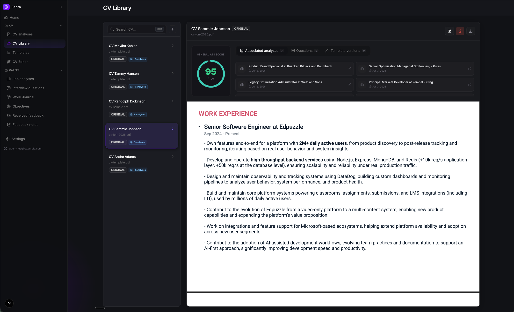
</p>

<table>
  <tr>
    <td width="50%" align="center">
      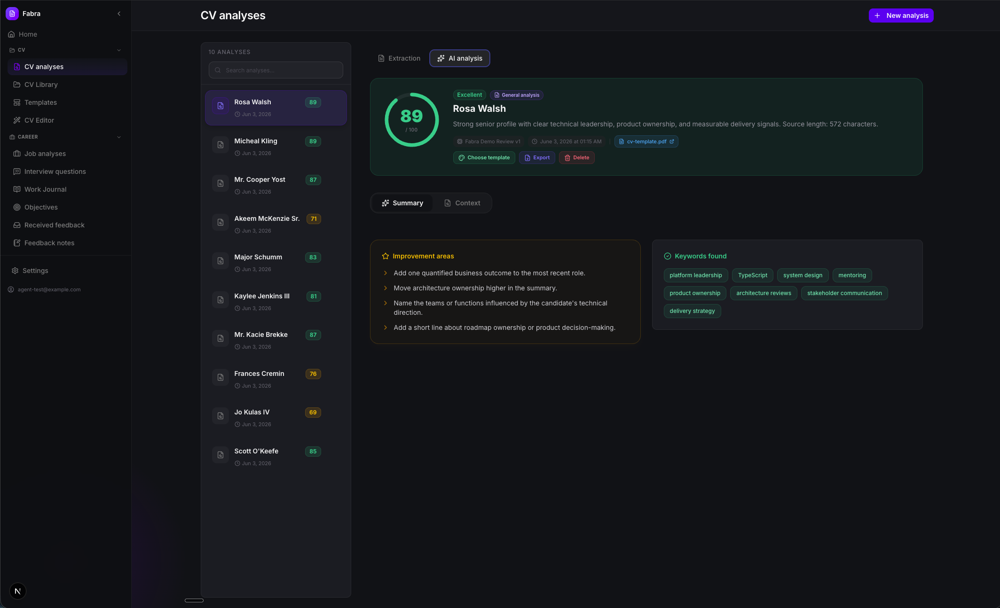
      <br /><strong>AI-powered CV analysis</strong>
    </td>
    <td width="50%" align="center">
      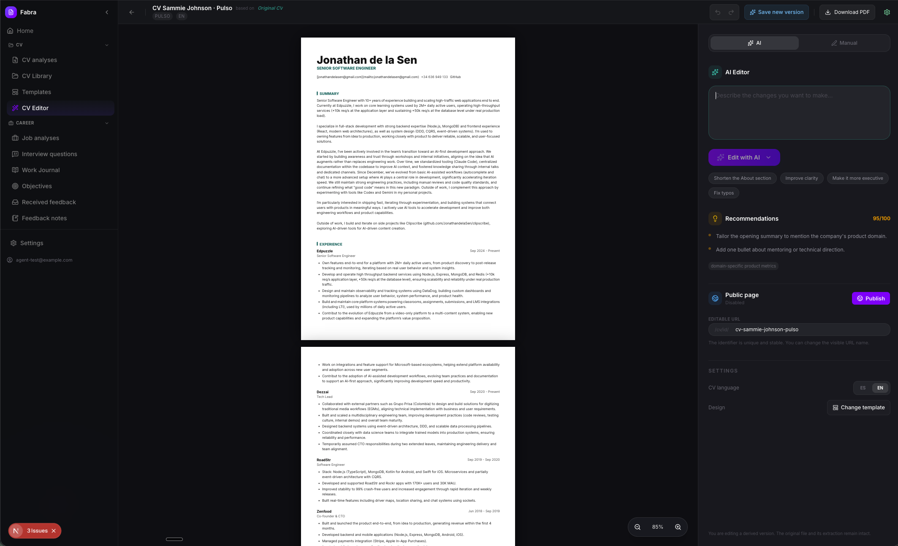
      <br /><strong>AI-assisted CV editor</strong>
    </td>
  </tr>
  <tr>
    <td width="50%" align="center">
      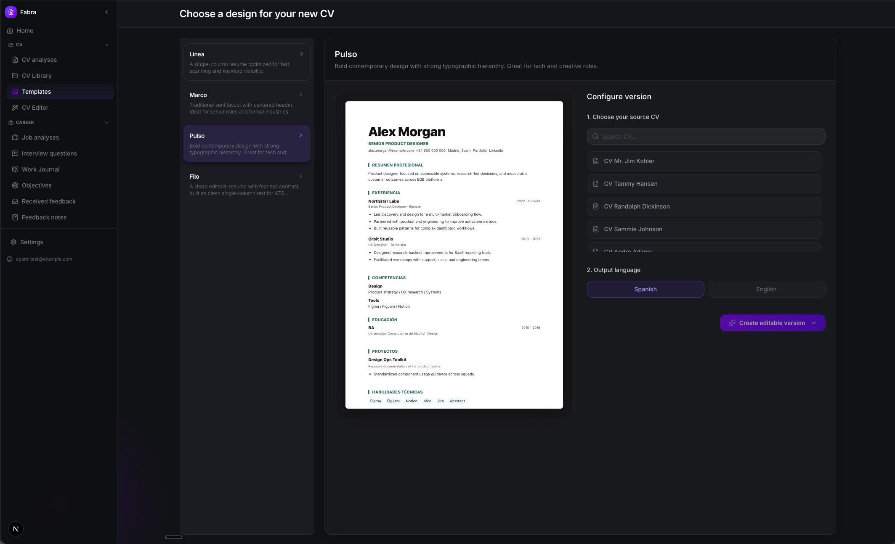
      <br /><strong>ATS-friendly templates</strong>
    </td>
    <td width="50%" align="center">
      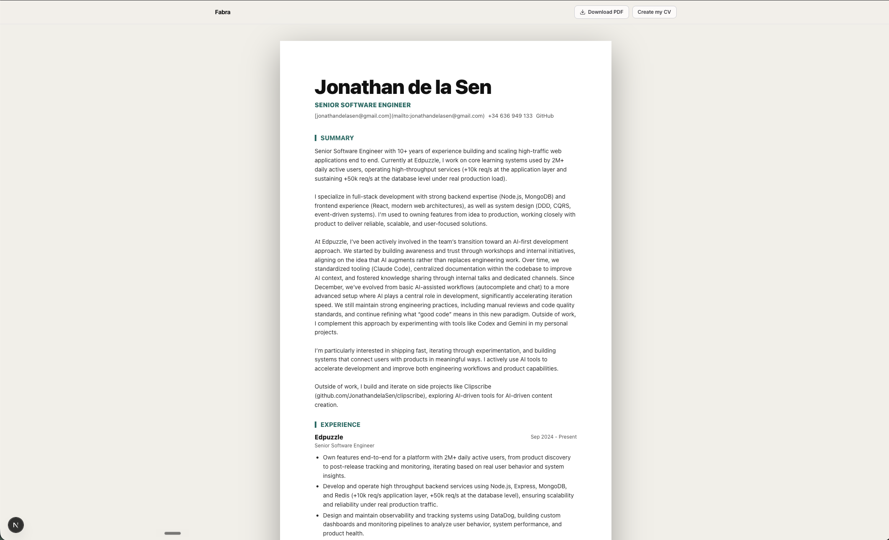
      <br /><strong>Shareable public CV</strong>
    </td>
  </tr>
</table>

### Run a focused job search

<p align="center">
  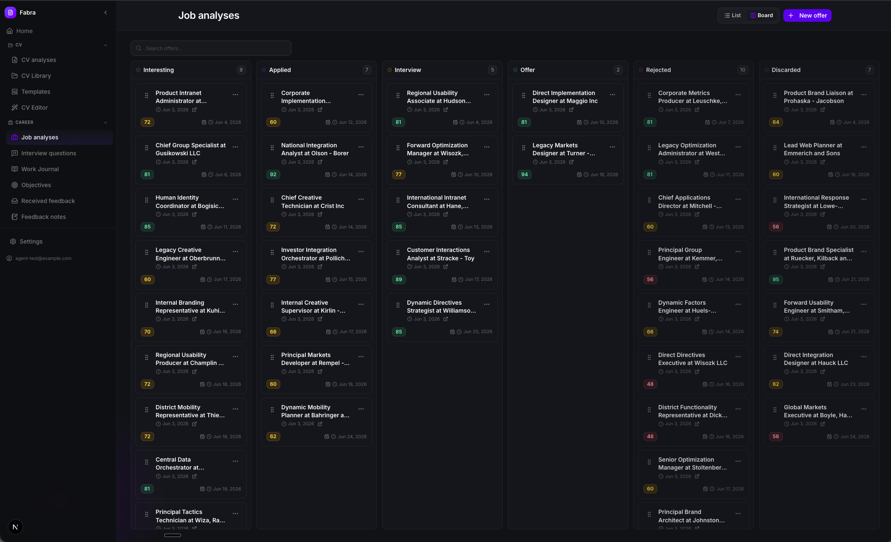
</p>

<table>
  <tr>
    <td width="50%" align="center">
      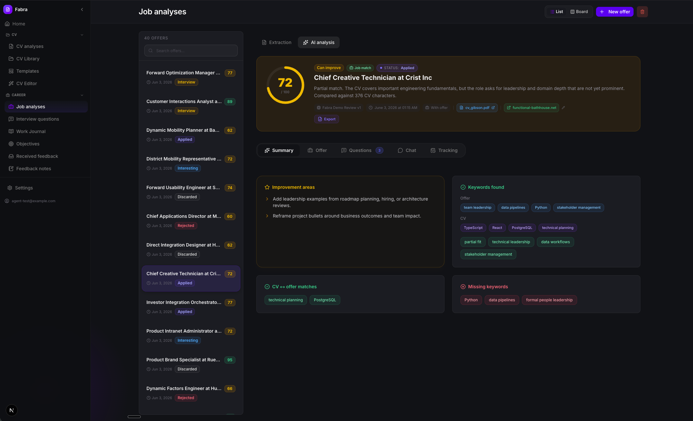
      <br /><strong>Job match and gap analysis</strong>
    </td>
    <td width="50%" align="center">
      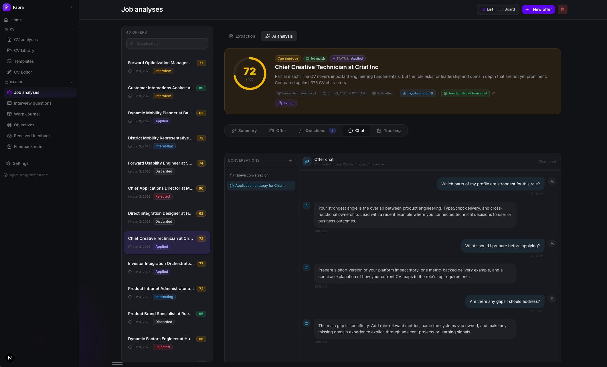
      <br /><strong>Context-aware job chat</strong>
    </td>
  </tr>
  <tr>
    <td colspan="2" align="center">
      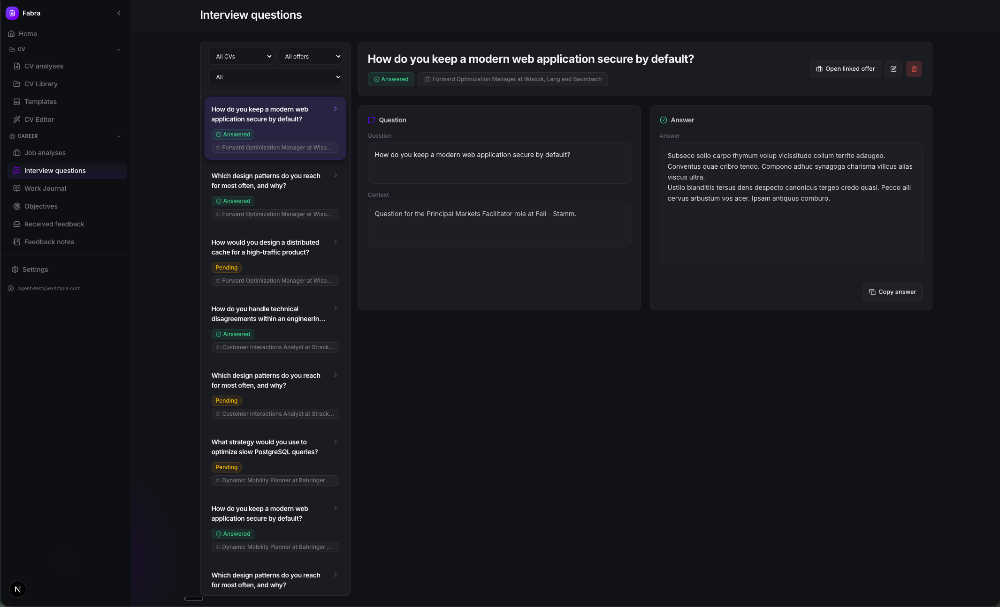
      <br /><strong>Tailored interview preparation</strong>
    </td>
  </tr>
</table>

### Turn everyday work into career momentum

<p align="center">
  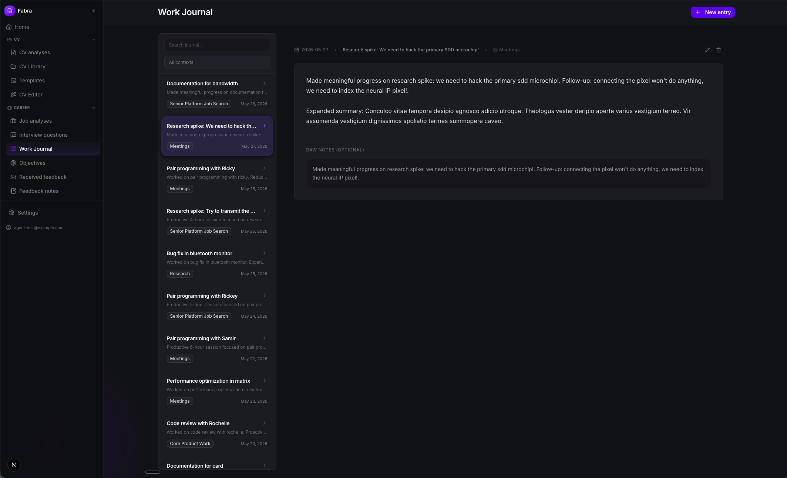
</p>

<table>
  <tr>
    <td width="50%" align="center">
      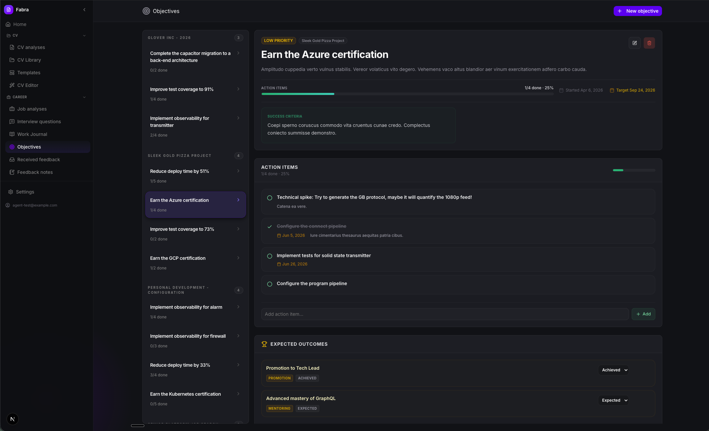
      <br /><strong>Career objectives and milestones</strong>
    </td>
    <td width="50%" align="center">
      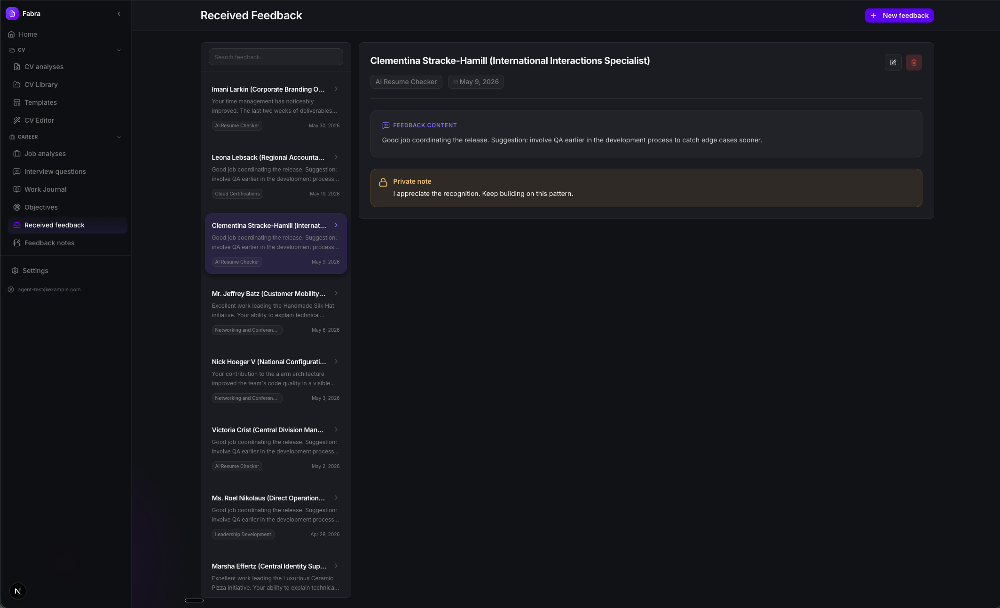
      <br /><strong>Received feedback tracker</strong>
    </td>
  </tr>
  <tr>
    <td colspan="2" align="center">
      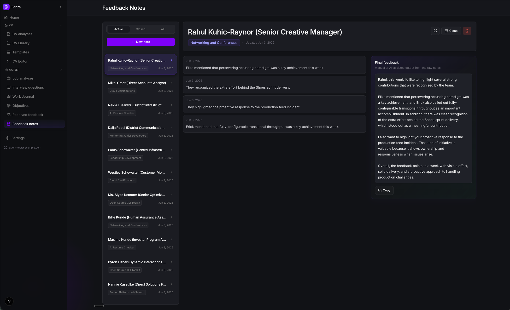
      <br /><strong>Professional feedback notes</strong>
    </td>
  </tr>
</table>

### Choose how AI assists you

<p align="center">
  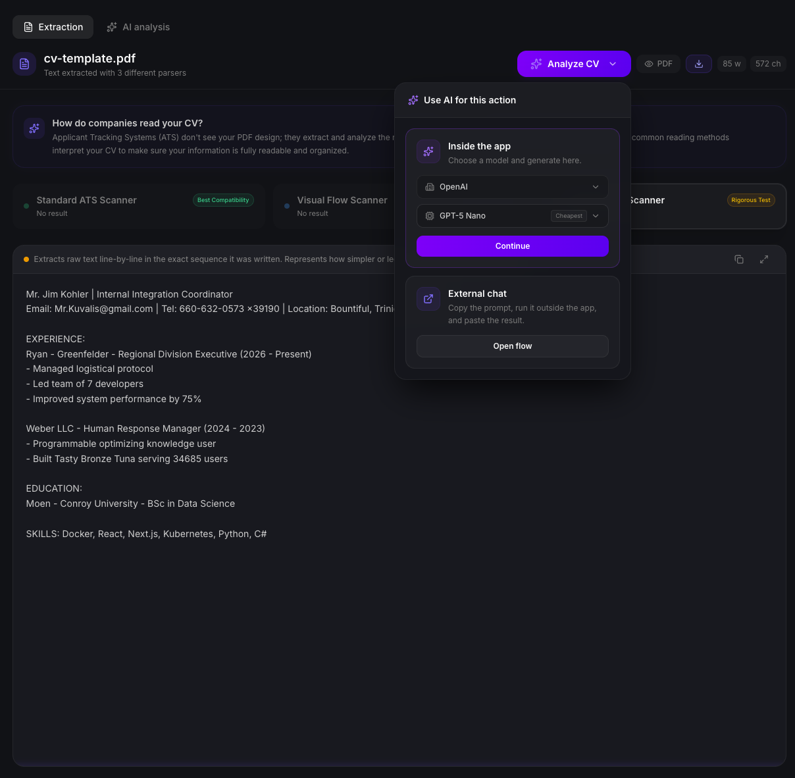
  <br /><strong>Integrated providers, local models, copy-paste workflows, or manual control</strong>
</p>

---

## 🛠️ Quick Start (Local Setup)

Get the project running on your local machine in just a few minutes.

### Prerequisites

- [Node.js](https://nodejs.org/) (v20+)
- [Docker](https://www.docker.com/) (required for local Supabase and the Python parser)

### 1. Clone the repository

```bash
git clone https://github.com/JonathandelaSen/fabra.git
cd fabra
npm install
```

### 2. Start the Database

We use [Supabase](https://supabase.com/) for authentication, database, and storage. You can run it entirely locally:

```bash
npm run supabase:start
```

_(Keep the terminal open to copy the Supabase keys generated in the output.)_

### 3. Environment Setup

```bash
cp env.sample .env.local
```

Fill in the variables in `.env.local`:

- `NEXT_PUBLIC_SUPABASE_PUBLISHABLE_KEY` & `SUPABASE_SERVICE_ROLE_KEY`: From the local Supabase start output.
- `PYTHON_PARSER_URL`: `http://127.0.0.1:8001` for local development.
- `PYTHON_PARSER_SECRET`: Shared secret used by the Next.js app to call the Python parser.

AI provider credentials are not configured in backend environment variables. Each user configures their own Gemini, OpenAI, or Ollama settings from the app Settings screen, and those preferences stay in that browser.

### 4. Start the Python Parser

The Python parser runs as a small local service and mirrors the production parser.

```bash
cp services/pdf-parser/env.sample services/pdf-parser/.env.local
```

Set `SUPABASE_SERVICE_ROLE_KEY` in `services/pdf-parser/.env.local` from the local Supabase output, then run:

```bash
npm run parser:dev
```

### 5. Run the App

```bash
npm run dev
```

🎉 **Open [http://localhost:3000](http://localhost:3000) and start uploading your CVs!**

---

## 🧱 Tech Stack

A modern, robust, and scalable foundation:

- **Frontend:** Next.js 16 (App Router), React 19, TailwindCSS 4, Framer Motion, `@dnd-kit/core`
- **Backend & DB:** Supabase (Auth, Postgres DB, Edge Storage)
- **AI Engines:** Multi-provider support using Google GenAI (`@google/genai`), OpenAI, and local Ollama.
- **Localization:** Integrated multilingual setup via `next-intl` (English and Spanish support).
- **File Processing:** `pdf-parse`, `pdfjs-dist`, Python `pdfminer.six`

---

## 🎨 Design & Aesthetics

The application is built on a highly polished, premium visual design system:

- **Aesthetic Excellence:** Curated harmonious OKLCH color palettes optimized for modern, high-contrast dark modes (eliminating raw CSS/Tailwind color codes in favor of cohesive design tokens).
- **Interactive UI:** Smooth transitions, micro-animations via Framer Motion, dynamic sidebar gradient highlights, and a global `app-glow` element.
- **Fluid Layouts:** Uses responsive, full-screen layouts that dynamically adapt to any viewport.

---

## 🧪 Testing Suite & Architecture

Maintain code quality and structural integrity with the robust validation suite:

- **DDD Boundaries:** Enforce hexagonal architecture boundaries and domain-driven design structure using strict verify scripts (`npm run ddd:check`).
- **Backend Tests:** Run tests against your local Supabase stack with `npm run test:backend`.
- **E2E Integration:** Full Playwright E2E coverage for both integrated and copy-paste workflow modes using `npm run test:e2e:local` or `npm run test:e2e:ui`.

---

## 🐍 Python Parser Deployment

Deploy the parser as a separate Vercel project named `fabra-python-parser`:

```bash
cd services/pdf-parser
vercel link
vercel env add PYTHON_PARSER_SECRET production
vercel env add SUPABASE_URL production
vercel env add SUPABASE_SERVICE_ROLE_KEY production
vercel --prod
```

Add these variables to the main Next.js Vercel project:

```env
PYTHON_PARSER_URL=https://fabra-python-parser.vercel.app
PYTHON_PARSER_SECRET=the-same-secret
```

<br/>

<div align="center">
  <i>Empower your job search with AI.</i>
</div>
